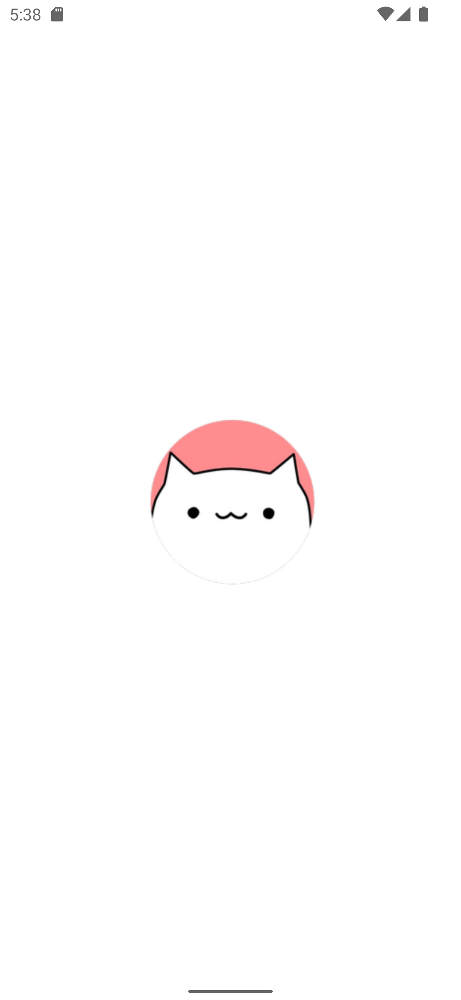
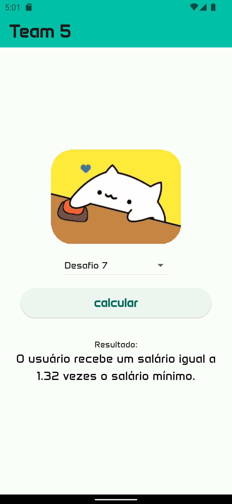
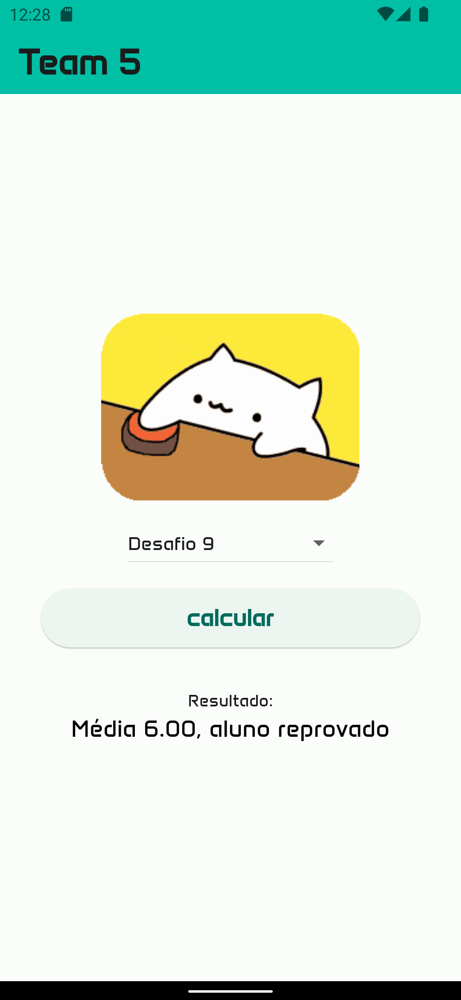

# 📑 Flutter Algorithms
## Sobre o projeto

Repositório de estudos de algoritmos em dart/Flutter 🚀🚀🚀🚀🚀🚀. 

## Screenshots

### Tecnologias utilizadas
* Flutter
* Dart

 ### 🚀 Team
<table>
  <tr>
      <td align="center"><a href="https://github.com/AlexandreCalmonJr"> <b>Alexandre Calmon</b></a> </td>
         <td align="center"><a href="https://github.com/devdados"> <b>Andrea Rangel</b></a> </td>
    <td align="center"><a href="https://github.com/evelyn-vanielly"> <b>Evelyn Vanielly</b></a> </td>
        <td align="center"><a href="https://github.com/jusylopes"> <b>Jusy Lopes</b></a> </td>
          <td align="center"><a href="https://github.com/Lucasnoc"> <b>Lucas Noc</b></a> </td>
         <td align="center"><a href="https://github.com/nubiabarcellar"> <b>Núbia Barcellar</b></a> </td>
    <td align="center"><a href="https://github.com/petronio50"> <b>Petronio Oliveira</b></a> </td>
        <td align="center"><a href="https://github.com/viniciusjsouza"> <b>Vinicius Souza</b></a> </td>  
      <td align="center"><a href="https://github.com/WillianSeidel"> <b>Willian Seidel</b></a> </td>    
  </tr>
</table>

